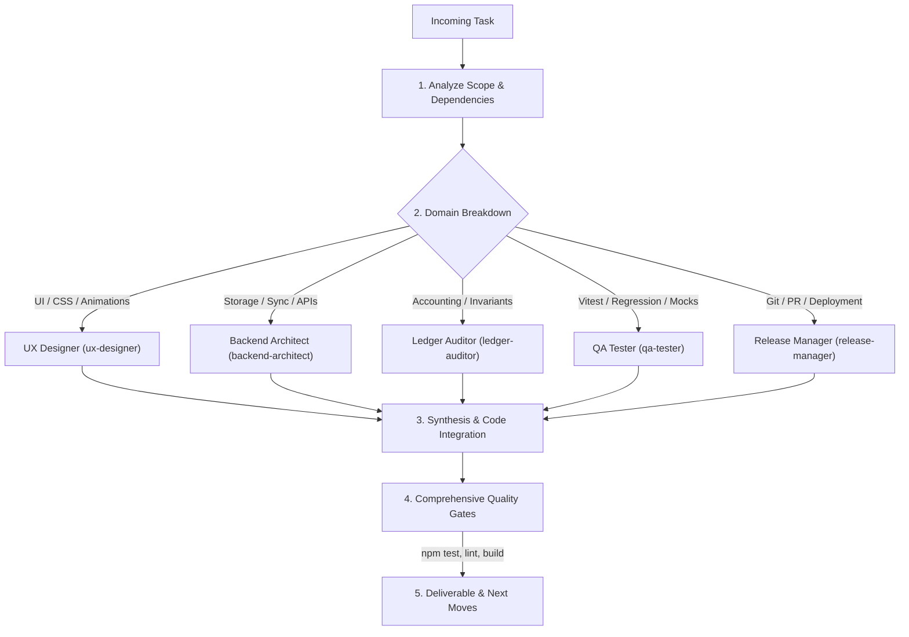

# Lead Developer Orchestration Procedure (`/lead-developer`)

Use this skill when leading, decomposing, coordinating, or synthesizing multi-faceted features, refactoring jobs, or complex bug fixes across the `lyrical-inventory` codebase.

---

## 1. Multi-Agent Team Dispatch Matrix

When tackling complex user requests, break down tasks by domain and assign them to the appropriate subagent persona or methodology:



---

## 2. Step-by-Step Execution Protocol

### Step 1: Decomposition & Dependency Mapping
1. Identify all affected layers: UI templates (`index.html`, `src/style.css`), business logic (`src/lib/`, `src/features/`), cloud/sync (`apps-script/Code.gs`, Firestore handlers), and test suites (`tests/`).
2. Verify existing invariants:
   - Vanilla JS only (no runtime frameworks).
   - Touch targets $\ge 44\text{px} \times 44\text{px}$.
   - All customer shipping is in CAD and untouched by FX conversion.
   - All monetary arithmetic uses `roundCents`.
   - Google Apps Script updates must sync to `public/gas-code.txt` and bump versions.

### Step 2: Autonomous Delegation & Implementation
1. Dispatch specific subagent tasks or apply domain skill procedures.
2. Implement cleanly in the workspace with defensive fallbacks: `${row.after ?? row._after ?? '—'}`.

### Step 3: Quality Gate Verification
Execute the mandatory test commands:
```bash
npm.cmd test
npm.cmd run lint
npm.cmd run build
```

### Step 4: Final Synthesis & Next Moves
Summarize the work completed and always provide the 7 "Next moves" ranked best-first with What, Why, and Effort.
