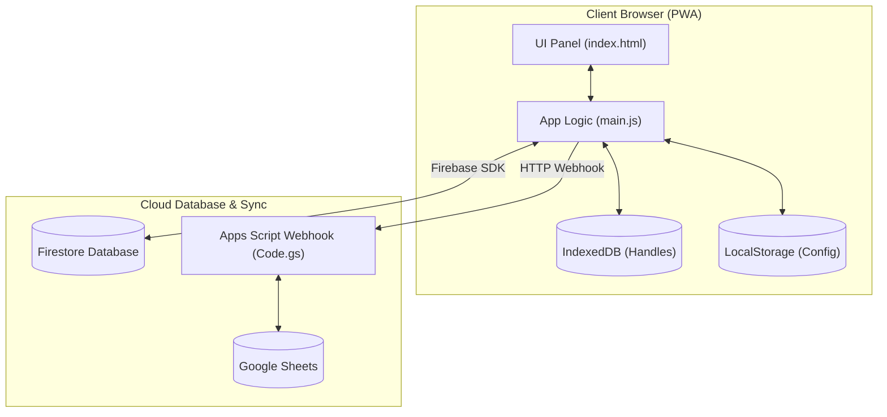

# AGENTS.md — lyrical-inventory

## Quick Commands
- **Dev (All):** `npm run dev:all` (Starts Vite frontend + Node.js backend)
- **Dev (Frontend):** `npm run dev`
- **Dev (Backend):** `npm run dev:backend` (Runs `backend/server.js`)
- **Lint:** `npm run lint` (ESLint checks)
- **Test:** `npm run test` (Vitest run once) or `npm run test:watch` (Vitest watch mode)
- **Build:** `npm run build` (Vite build production bundle)

## Core Entry Points
- **Frontend UI:** [index.html](file:///c:/Users/julia/.antigravity-ide/lyrical-inventory/index.html)
- **Frontend Logic:** [src/main.js](file:///c:/Users/julia/.antigravity-ide/lyrical-inventory/src/main.js)
- **Styles:** [src/style.css](file:///c:/Users/julia/.antigravity-ide/lyrical-inventory/src/style.css)
- **Local Backend:** [backend/server.js](file:///c:/Users/julia/.antigravity-ide/lyrical-inventory/backend/server.js)
- **Apps Script:** [apps-script/Code.gs](file:///c:/Users/julia/.antigravity-ide/lyrical-inventory/apps-script/Code.gs)

## Your job after every change
After completing any code enhancement, end your turn with a short "Next moves" list: 5 genuinely high-value suggestions for improving the app, ranked best-first.
Each suggestion is one or two lines:
- **What** — a concrete, specific action (e.g. "Debounce the catalog search box" instead of "improve performance").
- **Why** — the payoff (e.g. a sale not lost, a faster screen, a bug avoided).
- **Effort** — quick / medium / larger.

Then offer to do the top one right away.

### What makes a suggestion good here
- **Highly adaptive and context-tied:** Tied to what just changed or the latest discussion in the conversation. First ask yourself: did this edit or the last conversation/pull request open an edge case, threaten offline sync, or leave an obvious next step? Lead with that. Propose suggestions that branch directly from recent edits.
- **Dynamic, not static:** Do NOT output the same static list of suggestions across different turns. The recommendations must dynamically adapt to the immediate context of the conversation and recent commits/PRs. Avoid boilerplate or placeholder list filler.
- **Specific:** Name the file, function, or screen.
- **High-leverage:** Skip generic best-practice suggestions.
- **Honest:** If nothing is genuinely worth doing, say "nothing pressing" and stop.
- **No repeats:** Don't re-pitch anything already declined this session.

### Constraints every suggestion must respect
> [!IMPORTANT]
> - **Vanilla JS:** No framework, no build step, no bundler.
> - **Serverless Backend:** Firebase Firestore database and static hosting on GitHub Pages. No server or secret keys in client code.
> - **Offline Resilience:** Must work fully offline (PWA) and synchronize local queue states later.

### Angles worth scanning each time
Bug / edge case the change introduced · the next logical feature · offline & sync robustness · Firestore data integrity · the speed of a slow screen · keeping catalog and ledger consistent.

## Pull Requests
- When asked for "a new pull request", "new PR", or similar: **create it immediately** from the current branch.
- Do NOT investigate merge status, git history, or ask clarifying questions.
- Action: Push branch with `git push -u origin <branch>` then create PR via GitHub MCP.
- Use a descriptive PR title based on the feature/fix being implemented.
- **After a PR is merged, start the next change on a brand-new branch and open a new PR** — never push commits onto a merged branch to revive it.

## General Principles
- Prefer action over investigation when intent is clear.
- If the user asks for something, assume they know what they want.
- Only ask clarifying questions if the request is genuinely ambiguous.

## Customizations & Style Guidelines
- **Strict Guidelines:** Always adhere to the premium UX/UI, offline-first sync, financial ledger precision, role-based security, and spreadsheet integration rules defined in [.agents/AGENTS.md](file:///c:/Users/julia/.antigravity-ide/lyrical-inventory/.agents/AGENTS.md).

> [!WARNING]
> **Always update the externalized Apps Script copy** whenever [Code.gs](file:///c:/Users/julia/.antigravity-ide/lyrical-inventory/apps-script/Code.gs) is modified: copy it **verbatim** (no HTML-escaping) to [gas-code.txt](file:///c:/Users/julia/.antigravity-ide/lyrical-inventory/public/gas-code.txt). The "Connect your Google Sheet" tab in [index.html](file:///c:/Users/julia/.antigravity-ide/lyrical-inventory/index.html) lazy-fetches this file via `loadGasCode()` in [main.js](file:///c:/Users/julia/.antigravity-ide/lyrical-inventory/src/main.js) the first time the tab opens. Do **not** re-embed the source inline in [index.html](file:///c:/Users/julia/.antigravity-ide/lyrical-inventory/index.html).

## App Overview & Architecture

Lyrical Inventory is a Progressive Web App (PWA) designed for Lyricalmyrical Books to manage book catalogs, sales inventory, consignment partners, invoices, expenses, and event checkouts (POS).

### Architecture & Data Flow Diagram

### Key Modules & Capabilities

| Module | Purpose | Key Details |
| :--- | :--- | :--- |
| **Catalog & Stock** | Book inventory management | Tracks list price, native currency, print runs, and stock statuses (`on-hand`, `consigned`, `sold`, etc.) |
| **Consignment** | Store partnership ledger | Handles store commissions, shipments, returns, sales, invoice drafts, and artist payout settlements |
| **POS Checkout** | Live book fairs & checkouts | Event-ready checkout panel supporting multi-currency totals, FX rate conversion, and Stripe QR codes |
| **Order History** | Timeline & stock auditing | Filterable, paginated transaction lists matching direct sales against ledger records |
| **Tax & Expenses** | Cash flow & operations | Tracks operating costs, business trips, subscription schedules, and receipt OCR scans via Gemini API |

### Technical Stack
- **Frontend:** Vanilla HTML5 ([index.html](file:///c:/Users/julia/.antigravity-ide/lyrical-inventory/index.html)), CSS3 ([style.css](file:///c:/Users/julia/.antigravity-ide/lyrical-inventory/src/style.css)), and Vanilla JS ES Modules ([main.js](file:///c:/Users/julia/.antigravity-ide/lyrical-inventory/src/main.js)).
- **Backend:** Google Firebase (Firestore and Auth).
- **Integrations:** Google Sheets Webhook via Apps Script, Shippo API, and Stripe API.
