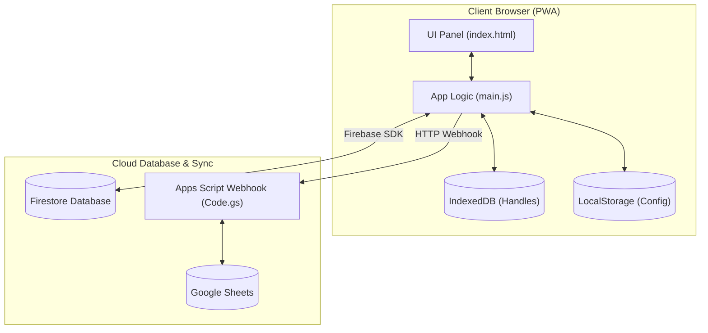

# AGENTS.md — lyrical-inventory

## Quick Commands
- **Dev (All):** `npm run dev:all` (Starts Vite frontend + Node.js backend)
- **Dev (Frontend):** `npm run dev`
- **Dev (Backend):** `npm run dev:backend` (Runs `backend/server.js`)
- **Lint:** `npm run lint` (ESLint checks)
- **Test:** `npm run test` (Vitest run once) or `npm run test:watch` (Vitest watch mode)
- **Build:** `npm run build` (Vite build production bundle)

## Core Entry Points
- **Frontend UI:** [index.html](index.html)
- **Frontend Logic:** [src/main.js](src/main.js)
- **Styles:** [src/style.css](src/style.css)
- **Local Backend:** [backend/server.js](backend/server.js)
- **Apps Script:** [apps-script/Code.gs](apps-script/Code.gs)

## Your job after every change
After completing any code enhancement, end your turn with a short "Next moves" list: 7 genuinely high-value suggestions for improving the app, ranked best-first.
Each suggestion is one or two lines:
- **What** — a concrete, specific action (e.g. "Debounce the catalog search box" instead of "improve performance").
- **Why** — the payoff (e.g. a sale not lost, a faster screen, a bug avoided).
- **Effort** — quick / medium / larger.

Then offer to do the top one right away.

### What makes a suggestion good here
- **Highly adaptive and context-tied:** Tied to what just changed or the latest discussion in the conversation. First ask yourself: did this edit or the last conversation/pull request open an edge case, threaten offline sync, or leave an obvious next step? Lead with that. Propose suggestions that branch directly from recent edits.
- **Dynamic, not static:** Do NOT output the same static list of suggestions across different turns. The recommendations must dynamically adapt to the immediate context of the conversation and recent commits/PRs. Avoid boilerplate or placeholder list filler.
- **Specific:** Name the file, function, or screen.
- **High-leverage:** Skip generic best-practice suggestions.
- **Honest:** If nothing is genuinely worth doing, say "nothing pressing" and stop.
- **No repeats:** Don't re-pitch anything already declined this session.

### Constraints every suggestion must respect
> [!IMPORTANT]
> - **Vanilla JS:** No framework (no React/Vue/Svelte) and no runtime dependencies. Vite is the bundler and must stay a thin build step — don't add framework runtimes or a heavier toolchain on top of it.
> - **Serverless Backend:** Firebase Firestore database and static hosting on GitHub Pages. No server or secret keys in client code.
> - **Offline Resilience:** Must work fully offline (PWA) and synchronize local queue states later.

### Angles worth scanning each time
Bug / edge case the change introduced · the next logical feature · offline & sync robustness · Firestore data integrity · the speed of a slow screen · keeping catalog and ledger consistent.

## Pull Requests
- When asked for "a new pull request", "new PR", or similar: **create it immediately** from the current branch.
- Do NOT investigate merge status, git history, or ask clarifying questions.
- Action: Push branch with `git push -u origin <branch>` then create PR via GitHub MCP.
- Use a descriptive PR title based on the feature/fix being implemented.
- **After a PR is merged, start the next change on a brand-new branch and open a new PR** — never push commits onto a merged branch to revive it.

## General Principles
- Prefer action over investigation when intent is clear.
- If the user asks for something, assume they know what they want.
- Only ask clarifying questions if the request is genuinely ambiguous.

## Customizations & Style Guidelines
- **Strict Guidelines:** Always adhere to the premium UX/UI, offline-first sync, financial ledger precision, role-based security, and spreadsheet integration rules defined in [.agents/AGENTS.md](.agents/AGENTS.md) and [.agents/skills/ux-designer/SKILL.md](.agents/skills/ux-designer/SKILL.md).
- **Pattern Reference:** Before writing a new list, dropdown, button, pill, table, or empty state, read [.agents/UX_PATTERNS.md](.agents/UX_PATTERNS.md) to reuse existing classes and design patterns before inventing new ones.

### State-of-the-Art UX/UI Architecture & Design Engineering
Any user-facing interface, component, or style change MUST follow the design standards in [.agents/skills/ux-designer/SKILL.md](.agents/skills/ux-designer/SKILL.md):

1. **Perceptual Color Science (OKLCH & P3 Gamut):**
   - Never use raw RGB, plain browser defaults (pure red, blue, green), or legacy HSL.
   - Use **OKLCH** (`oklch(L C H / alpha)`) for mathematically uniform perceptual lightness across light and dark themes.
   - Respect semantic tokens: Emerald/Teal for success, Rose/Coral for danger/errors, Amber for warnings, Indigo/Violet for primary branding.
   - Maintain strict WCAG 2.2 AAA / APCA contrast hierarchy: primary text (≥ 7:1), secondary text (≥ 4.5:1), subtle borders (`oklch(1 0 0 / 0.08)`).
   - Use multi-layered glassmorphism (`backdrop-filter: blur(20px) saturate(190%)`) with diffuse ambient glows instead of harsh solid shadows.

2. **Modern Layout Engine (Container Queries, Subgrid & Popover API):**
   - **Container Queries:** Components must adapt to their immediate parent container (`container-type: inline-size`), not viewport media queries.
   - **CSS Subgrid:** Align columns across distinct cards or nested rows using `grid-template-columns: subgrid`.
   - **Native Popover API & `:has()`:** Use native HTML `popover="auto"` and `popovertarget` for tooltips, dropdowns, and menus to eliminate z-index bugs; use `:has()` for parent-aware component states.

3. **Liquid Motion & Spring Physics:**
   - **View Transitions:** Use `document.startViewTransition()` for smooth layout morphing during tab switches, filtering, and modal launches.
   - **Spring Physics:** Never use linear animations. Apply physical spring curves (`--ease-spring: cubic-bezier(0.16, 1, 0.3, 1)` and `--ease-bounce: cubic-bezier(0.34, 1.56, 0.64, 1)`).
   - **Micro-Interactions:** Interactive elements must have fluid hover (`translateY(-2px)`), active (`scale(0.975)`), and `:focus-visible` feedback.
   - **Accessibility:** Always wrap motion in `@media (prefers-reduced-motion: reduce)` with instant transitions.

4. **Cognitive Ergonomics & Human Interface Science:**
   - **Fitts's Law:** Minimum interactive bounding box of **≥ 44px × 44px** with generous hit padding (`padding: 10px 18px`).
   - **Miller's Chunking:** Segment dense data/ledgers into scannable cards with distinct section headings.
   - **Doherty Threshold & Zero Perceived Latency:** Use optimistic UI updates and custom shimmer skeleton loaders matching exact content dimensions (never use generic spinner GIFs).
   - **Zero Blank States:** Empty tables and lists must include custom iconography, helpful conversational context, and an explicit call-to-action button.

5. **Financial & Data Engineering Invariants:**
   - **Tabular Figures (`tnum`):** All monetary figures, quantities, stock balances, and timestamps must use monospace tabular numbers (`font-feature-settings: "tnum" 1, "zero" 1` or `font-family: 'DM Mono', monospace`) for perfect vertical alignment.
   - **Decouple Styling from Data Pipelines:** DO NOT rewrite, simplify, or refactor underlying data aggregation functions (`buildOrderTimeline`, `deriveOnHand`, `inventoryBreakdown`). Keep data assembly 100% intact and modify ONLY CSS tokens, HTML wrapper classes, badge elements, and subtext formatting.
   - **Defensive Fallbacks:** Always wrap dynamic template outputs with nullish coalescing (`${row.after ?? row._after ?? '—'}`) to prevent `'undefined'` text rendering.
   - **Property Alignment:** Always verify exact property key names against underlying models before referencing them in template literals.

> [!WARNING]
> **Always update the externalized Apps Script copy** whenever [Code.gs](apps-script/Code.gs) is modified: copy it **verbatim** (no HTML-escaping) to [gas-code.txt](public/gas-code.txt). The "Connect your Google Sheet" tab in [index.html](index.html) lazy-fetches this file via `loadGasCode()` in [main.js](src/main.js) the first time the tab opens. Do **not** re-embed the source inline in [index.html](index.html).

> [!WARNING]
> **Always bump the script version** whenever [Code.gs](apps-script/Code.gs)'s behavior changes (new action, changed response shape, changed email/side-effect logic — not comment-only or pure-refactor edits). Three places move together, in the same commit:
> 1. `scriptVersion: 'vNN'` and the matching `service: 'lyrical-sheets-webhook-vNN'` string in the `doGet` capabilities response in [Code.gs](apps-script/Code.gs).
> 2. `EXPECTED_SCRIPT_VERSION` in [main.js](src/main.js) — this is what the client compares against to flag an out-of-date deployment on the connection card.
> 3. A new numbered entry in the version-history comment block at the top of [Code.gs](apps-script/Code.gs) describing what changed and, if relevant, which older deployments it flags as outdated.
> Skipping this means the publisher's already-deployed script silently diverges from what the client expects, with no warning surfaced anywhere.

## App Overview & Architecture

Lyrical Inventory is a Progressive Web App (PWA) designed for Lyricalmyrical Books to manage book catalogs, sales inventory, consignment partners, invoices, expenses, and in-person checkouts (POS).

### Architecture & Data Flow Diagram

```mermaid
graph TD
    subgraph Client ["Client Browser (PWA)"]
        UI["UI Panel (index.html)"]
        JS["App Logic (main.js)"]
        IDB[("IndexedDB (Handles)")]
        LS[("LocalStorage (Config)")]
    end

    subgraph Cloud ["Cloud Database & Sync"]
        FS[("Firestore Database")]
        GS[("Google Sheets")]
        Script["Apps Script Webhook (Code.gs)"]
    end

    UI <--> JS
    JS <--> IDB
    JS <--> LS
    JS <-->|Firebase SDK| FS
    JS -->|HTTP Webhook| Script
    Script <--> GS
```

### Key Modules & Capabilities

| Module | Purpose | Key Details |
| :--- | :--- | :--- |
| **Catalog & Stock** | Book inventory management | Tracks list price, native currency, print runs, and stock statuses (`on-hand`, `consigned`, `sold`, etc.) |
| **Consignment** | Store partnership ledger | Handles store commissions, shipments, returns, sales, invoice drafts, and artist payout settlements |
| **POS Checkout** | In-person & online sales | Checkout panel supporting multi-currency totals, FX rate conversion, and Stripe QR codes |
| **Order History** | Timeline & stock auditing | Filterable, paginated transaction lists matching direct sales against ledger records |
| **Tax & Expenses** | Cash flow & operations | Tracks operating costs, business trips, subscription schedules, and receipt OCR scans via Gemini API |

### Technical Stack
- **Frontend:** Vanilla HTML5 ([index.html](index.html)), CSS3 ([style.css](src/style.css)), and Vanilla JS ES Modules ([main.js](src/main.js)).
- **Backend:** Google Firebase (Firestore and Auth).
- **Integrations:** Google Sheets Webhook via Apps Script, Shippo API, and Stripe API.

## Multi-Agent Engineering Team & Personas

The workspace is configured with an elite multi-agent development team available in the Antigravity IDE agent selector and orchestratable via the Lead Developer:

| Persona | Identifier | Core Scope & Mission |
| :--- | :--- | :--- |
| **Lead Developer** | `lead-developer` | Chief Architect & Orchestrator. Decomposes tasks, coordinates domain subagents, synthesizes clean Vanilla JS code, and enforces comprehensive quality gates. |
| **UX Designer** | `ux-designer` | Design Engineer. Enforces OKLCH perceptual colors, Container Queries, Subgrid, View Transitions, spring motion physics, touch targets $\ge 44\text{px}$, and zero blank states. |
| **Backend Architect** | `backend-architect` | Cloud & Sync Engineer. Oversees Firestore security rules, offline IndexedDB sync queues, Apps Script triple-version parity (`Code.gs`), and Stripe/Shippo APIs. |
| **Ledger Auditor** | `ledger-auditor` | Financial Integrity Specialist. Enforces zero float drift (`roundCents`), double-entry balance equations, customer shipping CAD invariants, and tax ledgers. |
| **QA Tester** | `qa-tester` | Test Automation Engineer. Authors and maintains Vitest unit test suites (`tests/*.test.js`), edge-case coverage, mocks, and regression prevention. |
| **Release Manager** | `release-manager` | Release & Deployment Specialist. Manages Git branch hygiene, automated PR creation via GitHub MCP, version bumping, and GitHub Pages release builds. |

